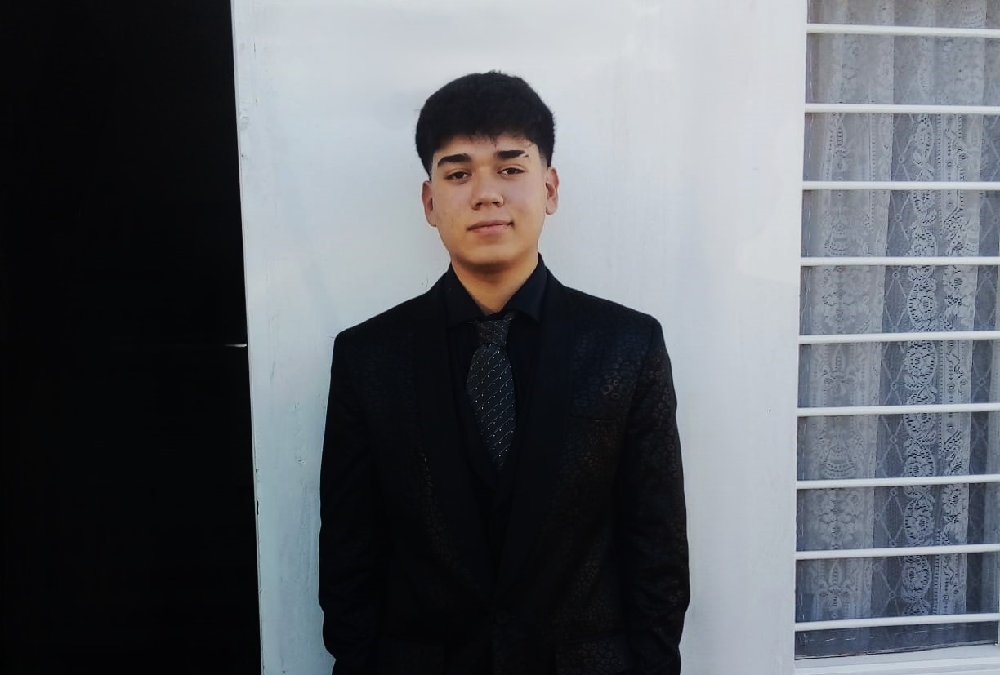

# Portafolio Profesional - Juan Pablo Medina



Bienvenido a mi portafolio profesional. Soy un **Desarrollador Full Stack** con una fuerte orientación al **Front-End**, enfocado en la **performance**, la **arquitectura limpia** y la **experiencia de usuario (UX)**.

Este proyecto es una vitrina de mis habilidades técnicas, proyectos destacados y trayectoria profesional, construido con las tecnologías más modernas y un diseño premium.

---

## 🚀 Tecnologías y Herramientas

Mi stack tecnológico está diseñado para crear aplicaciones escalables, rápidas y visualmente impactantes.

### Front-End
- **Frameworks:** React 19, Next.js 16.
- **Lenguajes:** TypeScript, JavaScript.
- **Estilos:** Tailwind CSS 4, CSS3, HTML5.
- **UI & Animaciones:** Framer Motion (Motion 12), GSAP, React Bits (Iridescence, Carousel, BlurText), Lucide React, Shadcn UI.

### Back-End & Base de Datos
- **Entorno:** Node.js, Express.
- **BaaS:** Supabase.
- **Databases:** PostgreSQL, MySQL, SQL Server.

### Herramientas & Otros
- **Diseño:** Figma.
- **Gestión:** Jira (Metodología Scrum), Lucid.
- **DevOps:** Git, GitHub, Vercel, Postman.
- **AI Tools:** OpenAI, Claude, Antigravity.

---

## 📂 Proyectos Destacados

### 1. Gestor de Clientes - GuargSystems
**Portal B2B Full-Stack** diseñado para optimizar la transparencia entre la administración y los clientes.
- **Features:** Sistema de roles, seguimiento de proyectos en tiempo real, portal privado para clientes.
- **Stack:** React, TypeScript, Next.js, Tailwind CSS, Supabase.

### 2. El Pequeño HongKong
**Portal de Gestión de Stock y E-commerce** para un bazar.
- **Features:** Carrito de compras persistente, integración con WhatsApp, panel de administración protegido con CRUD de productos.
- **Stack:** React, TypeScript, Tailwind CSS, Supabase.

### 3. Circular Local
Plataforma que fomenta la **economía circular** conectando cooperativas y recicladores.
- **Features:** Gestión de materiales y servicios sustentables, desarrollo bajo metodología Scrum.
- **Stack:** Angular, TypeScript, Node.js, Express, MySQL.

---

## 💼 Experiencia Profesional

- **Hyper Company (Miami, Florida) - Pasantía Full Stack:** Desarrollo de landing pages institucionales y aplicaciones e-commerce. Integración de componentes 3D con Three.js y gestión de estado con Context API.
- **Technology with Purpose Foundation - Proyecto Full Stack:** Desarrollo de la plataforma *Circular Local* supervisado por mentores de Santex, utilizando metodologías ágiles.

---

## ✨ Características Especiales

- **Animaciones Premium:** Implementación de animaciones de entrada para habilidades y transiciones fluidas con Framer Motion y GSAP.
- **Diseño Responsive Pro:** Optimización total para dispositivos móviles, incluyendo carruseles y layouts adaptativos.
- **Interacción Avanzada:** Efectos de hover dinámicos y micro-interacciones que mejoran la UX.
- **Gestión de CV:** Botón de descarga de CV integrado y accesible.
- **Performance:** Optimización nativa de Next.js para carga ultrarrápida.

---

## 🛠️ Instalación y Uso Local

Para ejecutar este proyecto en tu entorno local:

1. **Clona el repositorio:**
   ```bash
   git clone https://github.com/juampimedina06/portafolio-definitivo.git
   ```
2. **Instala las dependencias:**
   ```bash
   npm install
   ```
3. **Inicia el servidor de desarrollo:**
   ```bash
   npm run dev
   ```
4. **Visualiza el proyecto:**
   Abre [http://localhost:3000](http://localhost:3000).

---

## 📞 Contacto

¿Tienes un proyecto en mente o quieres charlar sobre tecnología?

- **LinkedIn:** [Juan Pablo Medina](https://www.linkedin.com/in/juan-pablo-medina-199b3b2b4/)
- **Email:** [jpmedinagomez1@gmail.com](mailto:jpmedinagomez1@gmail.com)

---

Desarrollado con ❤️ por **Juan Pablo Medina**
